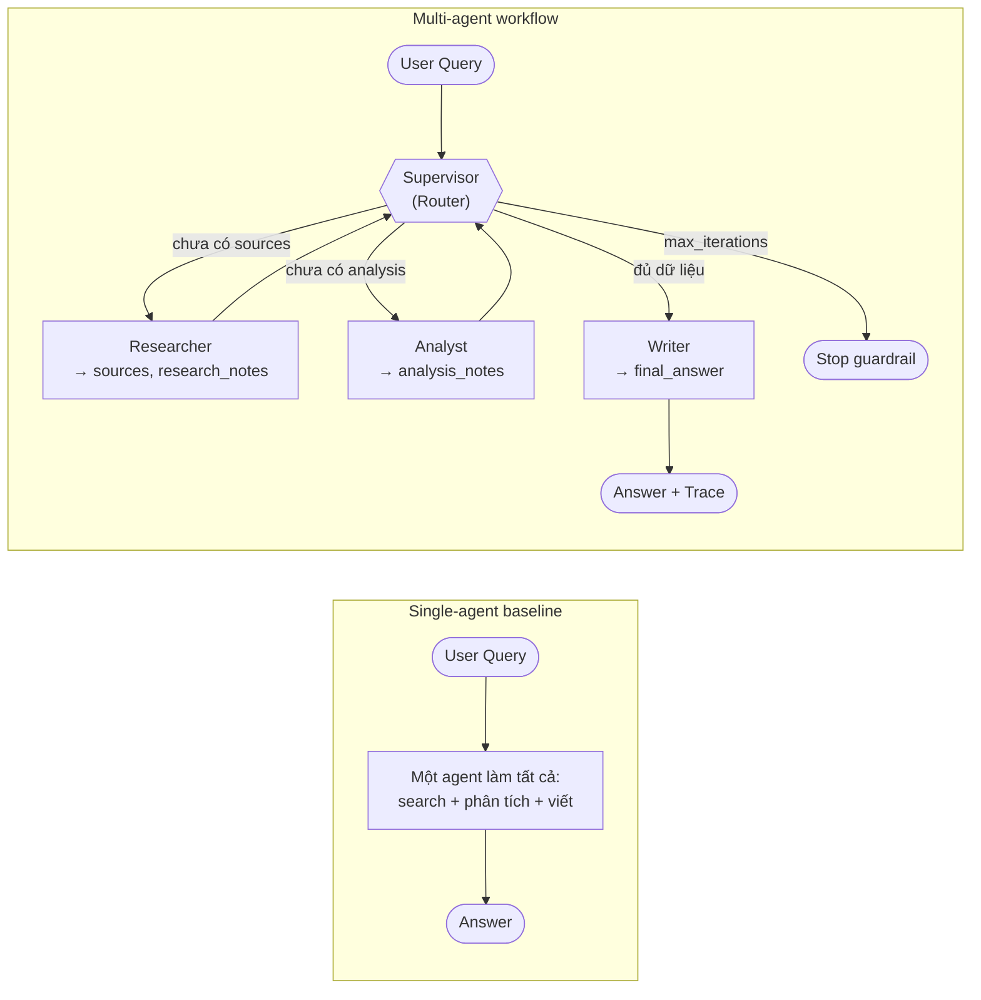
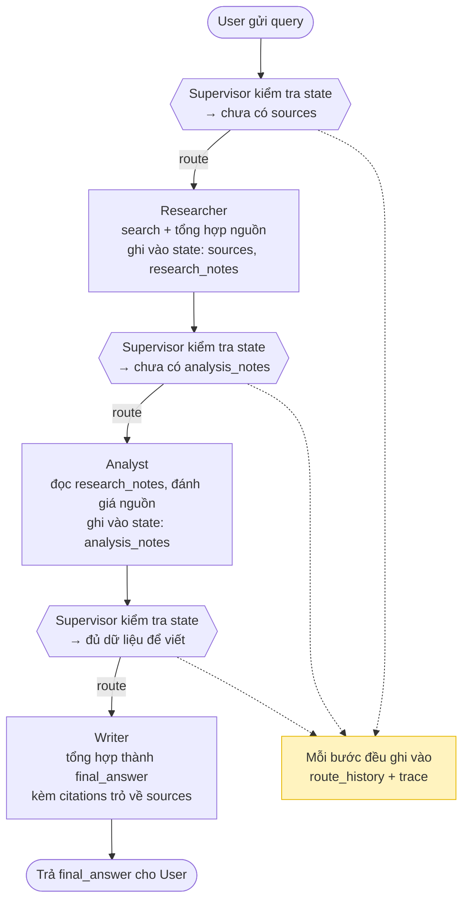

## Kiến trúc tổng thể

Hai cách làm bạn sẽ so sánh trong lab:



Luồng một lần chạy multi-agent điển hình (shared state chuyền qua từng bước):



## 1. Thuật ngữ cần biết

| Thuật ngữ gốc | Bản chất khái niệm | Minh hoạ trực quan |
| --- | --- | --- |
| Agent | Một "nhân viên" LLM có vai trò, prompt và công cụ riêng, nhận input từ state và trả output có cấu trúc | Researcher như thực tập sinh chuyên đi tìm tài liệu; Writer như biên tập viên chỉ lo viết |
| Supervisor / Router | Agent điều phối: nhìn state hiện tại và quyết định bước tiếp theo là gọi ai hoặc dừng | Trưởng nhóm đứng bảng phân công: "chưa có nguồn → gọi Researcher; đủ phân tích → gọi Writer" |
| Shared state | Cấu trúc dữ liệu duy nhất được truyền qua mọi agent, chứa toàn bộ ngữ cảnh của phiên làm việc | Tờ hồ sơ vụ việc chuyền tay trong văn phòng — ai làm xong phần mình thì ghi thêm vào |
| Handoff | Việc một agent hoàn thành và chuyển quyền xử lý (kèm state) cho agent khác | Researcher nộp `research_notes` vào hồ sơ rồi chuyển bàn cho Analyst |
| LangGraph | Framework xây workflow dạng đồ thị: node là agent, edge là luồng chuyển, có conditional routing | Sơ đồ dây chuyền sản xuất: mỗi trạm một việc, có nhánh rẽ tùy tình trạng sản phẩm |
| Guardrail | Cơ chế chặn agent chạy sai/vô hạn: max iterations, timeout, retry, validation | Cầu dao tự ngắt — vòng lặp Supervisor↔Researcher quá 6 lần thì hệ thống dừng, không đốt token vô ích |
| Trace | Bản ghi từng bước chạy: agent nào được gọi, input/output gì, tốn bao nhiêu token/thời gian | Hộp đen máy bay — khi kết quả sai, mở trace ra xem sai từ bước nào |
| Benchmark | So sánh có số liệu giữa các cách làm (latency, cost, quality) thay vì cảm tính | Đua hai đội cùng đề bài, chấm bằng đồng hồ + hóa đơn token + rubric, không chấm bằng "trông có vẻ hay" |

## 2. Mục tiêu & đầu ra

Bạn hoàn thành khi:

1. `python -m multi_agent_research_lab.cli baseline --query "..."` trả về câu trả lời thật từ LLM (không còn placeholder).
2. `python -m multi_agent_research_lab.cli multi-agent --query "..."` chạy hết workflow Supervisor → Researcher → Analyst → Writer và in ra `final_answer` kèm `route_history`.
3. Có trace xem được (LangSmith/Langfuse screenshot hoặc link) cho ít nhất 1 lần chạy multi-agent.
4. Có file `reports/benchmark_report.md` so sánh single vs multi-agent với ít nhất 3 metric: latency, cost, quality.
5. `make lint` và `make test` pass; không còn `StudentTodoError` khi chạy các lệnh trên.

## 3. Chuẩn bị

**Công cụ:**

- Python 3.11+ (khuyến nghị 3.12), `git`, terminal (macOS/Linux/WSL).
- Editor có Python support (VS Code / Kiro / PyCharm).

**API keys (điền vào `.env`):**

- `GEMINI_API_KEY` — bắt buộc nếu dùng API thật (hoặc fallback generator khi offline / không có key).
- `TAVILY_API_KEY` — tùy chọn; nếu không có, implement mock search trong `services/search_client.py`.
- `LANGSMITH_API_KEY` hoặc `LANGFUSE_*` — tùy chọn cho tracing (khuyến nghị có ít nhất một).

**Setup môi trường:**

```bash
git clone https://github.com/VinUni-AI20k/VinUni-AI20k-K3-Track3-Lab20-MultiAgent.git
cd VinUni-AI20k-K3-Track3-Lab20-MultiAgent
python -m venv .venv && source .venv/bin/activate
pip install -e ".[dev,llm]"
cp .env.example .env   # rồi điền API keys
make test              # 4 tests phải pass ngay từ đầu
```

> **macOS lưu ý:** nếu gặp `SSLCertVerificationError` khi gọi API, xem mục Troubleshooting trong `docs/lab_guide.md` (fix bằng `certifi` hoặc `Install Certificates.command`).

## 4. Thực hành

Tìm toàn bộ điểm cần làm bằng: `grep -R "TODO(student)" -n src tests docs`

### Bước 1 — LLM client & Baseline (0-30')

- Implement `services/llm_client.py`: gọi LLM thật, trả structured output.
- Sửa command `baseline` trong `cli.py`: thay placeholder bằng một call LLM end-to-end.
- **Kết quả mong đợi:** chạy `make run-baseline` in ra câu trả lời thật, ghi lại latency và token usage để so sánh sau.

### Bước 2 — Supervisor & Workflow (30-90')

- Implement routing policy trong `agents/supervisor.py`: dựa vào state (đã có `sources`? đã có `analysis_notes`?) để quyết định route tiếp theo.
- Implement `graph/workflow.py`: build LangGraph với các node supervisor/researcher/analyst/writer, conditional edges, và stop condition (dùng `max_iterations` từ config).
- **Kết quả mong đợi:** `make run-multi` không còn báo `StudentTodoError` ở workflow; `route_history` trong output thể hiện đúng thứ tự routing.

### Bước 3 — Worker agents (90-150')

- `agents/researcher.py`: gọi `SearchClient` (Tavily hoặc mock), ghi `sources` + `research_notes` vào state.
- `agents/analyst.py`: đọc `research_notes`, sinh `analysis_notes` (so sánh, đánh giá độ tin cậy nguồn).
- `agents/writer.py`: tổng hợp thành `final_answer` có citation trỏ về `sources`.
- **Kết quả mong đợi:** chạy end-to-end ra `final_answer` có trích dẫn; state chứa đủ dữ liệu trung gian để debug.

### Bước 4 — Trace & Benchmark (150-210')

- Implement `observability/tracing.py` với LangSmith/Langfuse (hoặc OpenTelemetry).
- Implement `evaluation/benchmark.py` + `evaluation/report.py`: chạy cùng bộ query qua cả baseline và multi-agent, đo latency/cost/quality/citation coverage/failure rate.
- Viết `reports/benchmark_report.md`.
- **Kết quả mong đợi:** mở được trace UI thấy từng agent step; report có bảng số liệu so sánh và 1 đoạn phân tích failure mode.

### Bước 5 — Peer review & Exit ticket (210-240')

- Review chéo theo `docs/peer_review_rubric.md` (5 tiêu chí × 0-2 điểm).
- Trả lời exit ticket trong `docs/lab_guide.md`: case nào nên / không nên dùng multi-agent, vì sao.

## 5. Kiểm tra kết quả

**Tự kiểm tra:**

```bash
make lint        # ruff: phải "All checks passed!"
make test        # pytest: tất cả pass
make run-baseline
make run-multi   # không còn panel "Expected TODO"
grep -R "TODO(student)" -n src | wc -l   # các TODO cốt lõi đã được thay bằng implementation
```

**Lỗi thường gặp:**

| Lỗi | Nguyên nhân | Cách xử lý |
| --- | --- | --- |
| `StudentTodoError: implement MultiAgentWorkflow.run` | Chưa implement workflow — đây là hành vi mặc định của starter | Làm Bước 2 |
| `SSLCertVerificationError` trên macOS | Python không tìm thấy CA bundle của hệ điều hành | Xem Troubleshooting trong `docs/lab_guide.md`: dùng `certifi` hoặc chạy `Install Certificates.command` |
| Workflow lặp vô hạn Supervisor ↔ Researcher | Thiếu stop condition / không tăng `iteration` | Dùng `state.record_route()` và check `max_iterations` từ `Settings` |
| `401 Unauthorized` khi gọi LLM | Chưa điền key vào `.env` hoặc chưa `cp .env.example .env` | Kiểm tra `.env`, không hard-code key trong code |
| Output multi-agent kém hơn baseline | Bình thường! Multi-agent không phải lúc nào cũng thắng | Ghi nhận vào benchmark report và phân tích trade-off — đây chính là learning outcome |

## 6. Nộp bài

Artefact cần nộp:

1. **Link GitHub repo cá nhân** — code hoàn chỉnh, `make lint` + `make test` pass, không còn `StudentTodoError` ở luồng chính.
2. **Trace evidence** — screenshot hoặc link LangSmith/Langfuse của ít nhất 1 lần chạy multi-agent end-to-end.
3. **`reports/benchmark_report.md`** — bảng so sánh single vs multi-agent (tối thiểu: latency, cost, quality) + 1 đoạn giải thích failure mode gặp phải và cách fix.
4. **Exit ticket** — trả lời 2 câu hỏi trong `docs/lab_guide.md` (khi nào nên / không nên dùng multi-agent).
