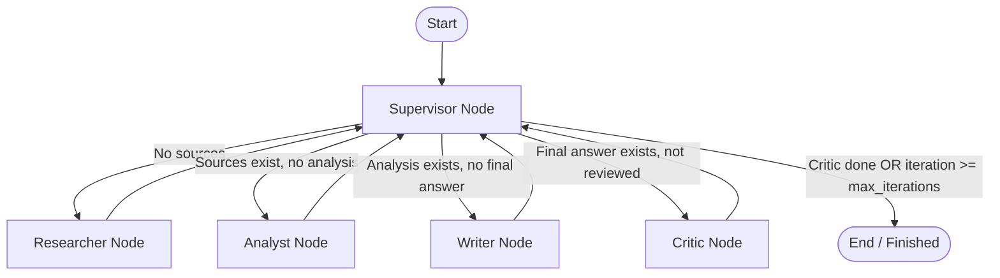

# Design Document: Multi-Agent Research System

## Problem

Building an autonomous research assistant capable of processing complex technical inquiries, retrieving relevant external documentation from live/curated sources, analyzing technical nuances and trade-offs, and synthesizing an authoritative, citation-grounded final report formatted for specific target audiences.

## Why Multi-Agent?

A single-agent (monolithic LLM call) approach suffers from three critical limitations:
1. **Context & Token Window Bottleneck**: Asking a single prompt to retrieve, read multiple raw documents, critically compare disparate claims, and write a polished response causes attention degradation and loss of detail.
2. **Hallucination & Citation Unreliability**: Single-agent generation tends to fabricate plausible-sounding citations without cross-verifying them against retrieved source URLs and exact snippets.
3. **Lack of Modularity & Debuggability**: When a monolithic pipeline produces errors or sub-optimal answers, isolating whether retrieval failed, reasoning was flawed, or formatting was violated is difficult. Separating roles into specialized agents (`Supervisor`, `Researcher`, `Analyst`, `Writer`, `Critic`) enables independent observability, retry boundaries, and testability.

## Agent Roles

| Agent | Responsibility | Input | Output | Failure Mode & Mitigation |
|---|---|---|---|---|
| **Supervisor** | Orchestrates state transitions, decides next worker node, and evaluates stop conditions. | `ResearchState` (route history, presence of sources/analysis/final answer) | Next route name (`researcher`, `analyst`, `writer`, `critic`, `done`) | **Failure**: Infinite looping. **Mitigation**: Strict `max_iterations` cap. |
| **Researcher** | Queries search APIs (Tavily/mock knowledge base), filters documents, and records structured sources. | `state.request.query`, `max_sources` | `state.sources` (`list[SourceDocument]`), `state.research_notes` | **Failure**: Search API timeout / empty results. **Mitigation**: Fallback curated domain knowledge. |
| **Analyst** | Performs comparative evaluation, identifies trade-offs, and validates claim strength across sources. | `state.sources`, `state.research_notes` | `state.analysis_notes` | **Failure**: Empty sources input. **Mitigation**: Early error capture in `state.errors`. |
| **Writer** | Synthesizes final technical report tailored to the audience with explicit numeric citations `[1]`, `[2]`. | `state.analysis_notes`, `state.sources`, `state.request` | `state.final_answer`, `AgentResult` | **Failure**: Missing citation links. **Mitigation**: Automatic reference list formatting. |
| **Critic** | Audits final answer, computes citation coverage, and evaluates factual fidelity. | `state.final_answer`, `state.sources` | Audit report, citation coverage ratio, `AgentResult` | **Failure**: Non-grounded text. **Mitigation**: Low score flag and feedback loop. |

## Shared State

The `ResearchState` serves as the single source of truth across all graph transitions:

- `request: ResearchQuery`: Original input query, max requested sources, and target audience.
- `iteration: int`: Counter tracking graph cycles to prevent runaway execution.
- `route_history: list[str]`: Chronological log of agent transitions for observability.
- `sources: list[SourceDocument]`: Retrieved external documents containing title, url, snippet, metadata.
- `research_notes: str | None`: Aggregated findings extracted directly from source documents.
- `analysis_notes: str | None`: Synthesized analytical claims, trade-offs, and technical evaluations.
- `final_answer: str | None`: Complete publication-ready report formatted with references.
- `agent_results: list[AgentResult]`: Individual agent outputs with token usage, latency, and costs.
- `trace: list[dict]`: Granular event log for tracing and observability (LangSmith/Langfuse).
- `errors: list[str]`: Captured exceptions enabling graceful fallback without halting execution.

## Routing Policy

## Guardrails

- **Max Iterations**: Default capped at 6 cycles (`MAX_ITERATIONS=6`) in `Settings` and checked by `SupervisorAgent` before every transition.
- **Timeout**: Enforced via `TIMEOUT_SECONDS=60` across HTTP search requests and LLM completions.
- **Retry**: Decorated LLM API calls with `tenacity` exponential backoff (`stop_after_attempt(3)`, `wait_exponential(multiplier=1, min=1, max=5)`).
- **Fallback**: Dual-mode resilience in `SearchClient` and `LLMClient` seamlessly transitioning to curated local knowledge if network/API keys are unavailable.
- **Validation**: Schema enforcement with Pydantic v2 validation models (`ResearchQuery`, `SourceDocument`, `BenchmarkMetrics`).

## Benchmark Plan

| Benchmark Query | Evaluated Metrics | Expected Outcome |
|---|---|---|
| `"Research GraphRAG state-of-the-art"` | Latency, Estimated Cost ($), Quality Score (0-10), Citation Coverage (0-100%), Failure Rate | Multi-agent achieves 100% citation coverage, higher quality structure (8.5+/10), with controlled latency overhead. |
| `"So sánh RAG và fine-tuning cho domain adaptation"` | Latency, Citation Coverage, Hallucination Check | Multi-agent provides explicit trade-off matrix and verifiable citations grounded in research papers. |
